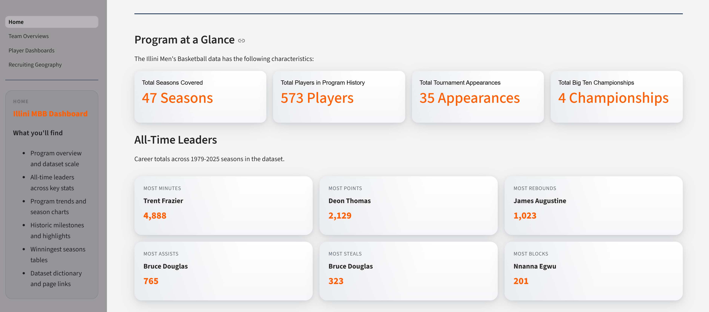
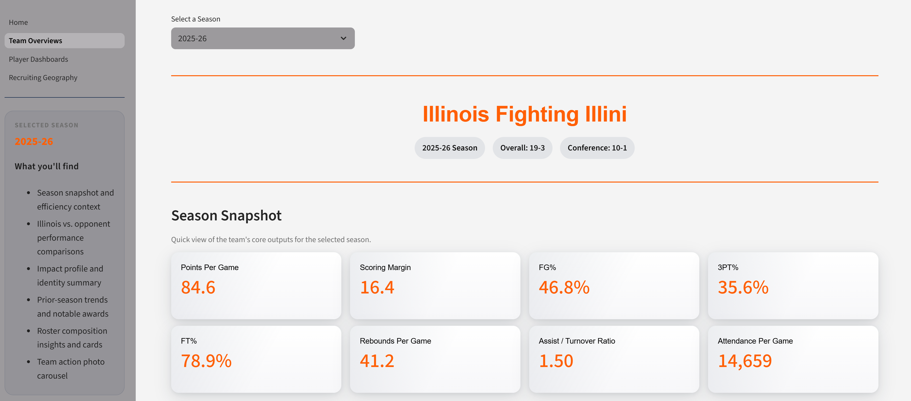
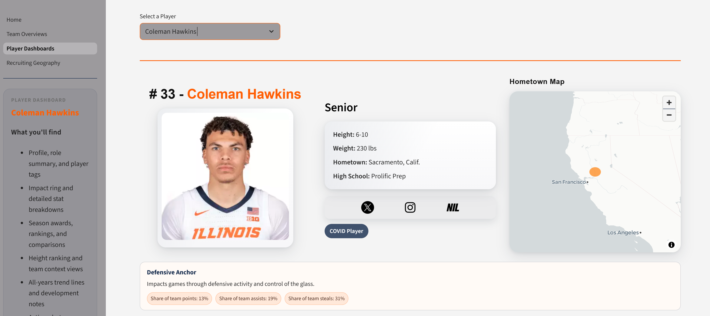
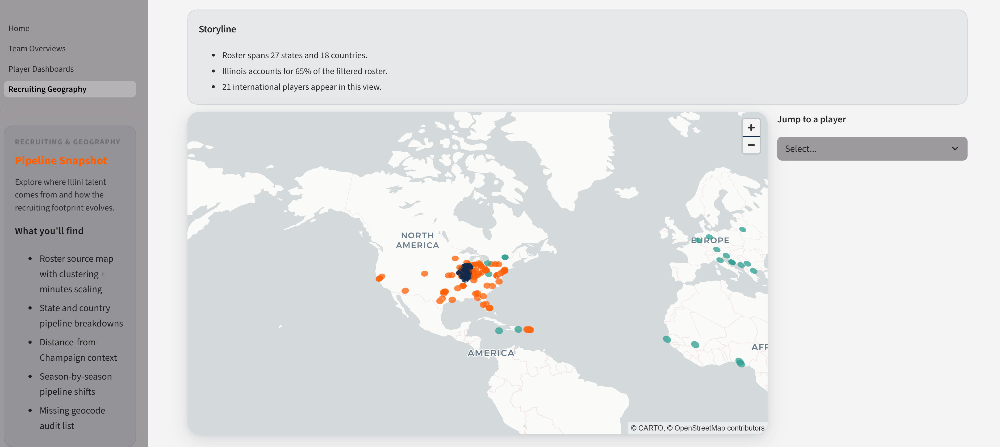

# Illini Basketball Dashboard


## Project Link
Streamlit Dashboard: [illini-basketball.streamlit.app](https://illini-basketball.streamlit.app)
## Project summary
This project is a Streamlit-based analytical dashboard for exploring the history, performance, and player-level detail of the Illinois Men's Basketball program. It is designed for quick exploration and deeper analysis, combining season-level results, player statistics, program achievements, and recruiting geography into one cohesive interface. The tone is intentionally accessible: it should feel like a data notebook that is happy to show its work.

## Why this dashboard exists
- Provide a single place to explore Illinois men's basketball history with a consistent data model.
- Translate raw tables into visually interpretable trends and comparisons.
- Offer a practical demonstration of data engineering, enrichment, and front-end storytelling in Streamlit.

## Application pages
### Home (Home.py)

- Program-level overview that summarizes the dataset scale and historical coverage.
- All-time leaders computed from aggregated player stats (minutes, points, rebounds, assists, steals, blocks).
- Season trends, including points, points per game, attendance, and wins/losses.
- Program history highlights (titles, Final Fours, NCAA appearances, conference championships).
- Winningest seasons leaderboards (overall and Big Ten).
- Dataset dictionary with last-updated timestamps to aid data currency checks.

### Team Overviews (pages/2_Team_Overviews.py)

- Season-focused deep dives that compare Illinois vs. opponents across key metrics.
- Team efficiency and identity summaries to capture how each season's team played.
- Roster composition insights, including position and class-year context.
- Season awards and notable stat markers to flag outlier performance.
- Program achievement callouts that place each season in historical context.

### Player Dashboards (pages/3_Player_Dashboards.py)

- Player-level profiles with career totals and season-by-season performance.
- Impact visualizations designed to compare a player's contributions across metrics.
- Notable season stats and rankings for quick career highlight scans.
- Action imagery and links back to the related team seasons for context.

### Recruiting and Geography (pages/4_Recruiting_Geography.py)

- Recruiting pipeline analysis by state and country, including pipeline growth and new pipelines.
- Year filtering to compare geographic shifts across eras.
- Derived recruiting geography dataset built from player hometowns and geocoding.

### Media Showcase (pages/5_Media_Showcase.py)
- Full gallery of every available action photo across the dataset.
- Pill selector to switch between normal, large, and x-large photo layouts.

<table>
  <tr>
    <td></td>
    <td></td>
    <td></td>
  </tr>
  <tr>
    <td></td>
    <td></td>
    <td></td>
  </tr>
  <tr>
    <td></td>
    <td></td>
    <td></td>
  </tr>
</table>

## Data assets
### Primary processed datasets
- `data/processed/season_stats.csv`: Season aggregates for Illinois and opponents. Supports trend lines, wins/losses, and attendance context.
- `data/processed/player_list.json`: Master roster list with player metadata, height, jersey number, hometown, and seasons played.
- `data/processed/player_stats/*.csv`: Per-season player stat lines used for career totals, leaderboards, and comparisons.
- `data/processed/recruiting_geography.csv`: Derived geography dataset with hometown, geocodes, and state/country tags for pipeline analysis.

### Supporting datasets
- `data/processed/players/*.json`: Player-specific profiles used in dashboards and roster cards.
- `data/processed/teams/*.json`: Season-level team metadata used in team overview pages.
- `data/processed/mbb_history_csv/*.csv`: Program milestones and award tables (NCAA appearances, conference titles, winningest seasons).

### Media assets
- `data/images/*`: Action photos, banners, and historical imagery used to keep the UI from feeling like a spreadsheet in disguise.


## Data pipeline and sources
The data is assembled via Python scrapers in `scrapers/`, which collect season stats, player bios, roster indexes, and program history tables. The recruiting geography dataset is derived from player hometowns and enriched with geocoding. The pipeline outputs are stored in `data/processed/` so the dashboard can load quickly.

## Full data build (one command)
The full rebuild lives in `scrapers/full_data_build.py` and is driven by the `build_all()` function. It refreshes every dataset used by the app, including player lists, season stats, history tables, player metadata, team season summaries, and per-season player stats.

Run the full build from the project root:

```
python scrapers/full_data_build.py
```

Advanced usage in a Python shell or notebook:

```
from scrapers.full_data_build import build_all
summary = build_all(start_year=1944, end_year=None, do_geocode=True, verbose=True)
print(summary)
```

Notes:
- `end_year=None` auto-selects the latest season based on a May 1 season rollover.
- `do_geocode=True` will attempt geocoding for hometowns and can be toggled off if you want a faster run.

## Running the app
- Ensure a Python environment with Streamlit, Pandas, and Plotly installed.
- From the project root, run:
  streamlit run Home.py

## Notes and assumptions
- Season totals may be incomplete for a current or in-progress season.
- Some historical records may have gaps depending on source availability.
- Player name normalization is handled during processing, but edge cases can still occur.

## Suggested reading order
If you are new to the dashboard, start with Home, then move to Team Overviews to pick a season, and finish with Player Dashboards to see how individual careers unfold. Recruiting and Geography is best as a capstone section when you want to see where the pipeline has moved over time.

## Contact
For questions or improvements, please reach out to the project owner.
